# Лид-формы

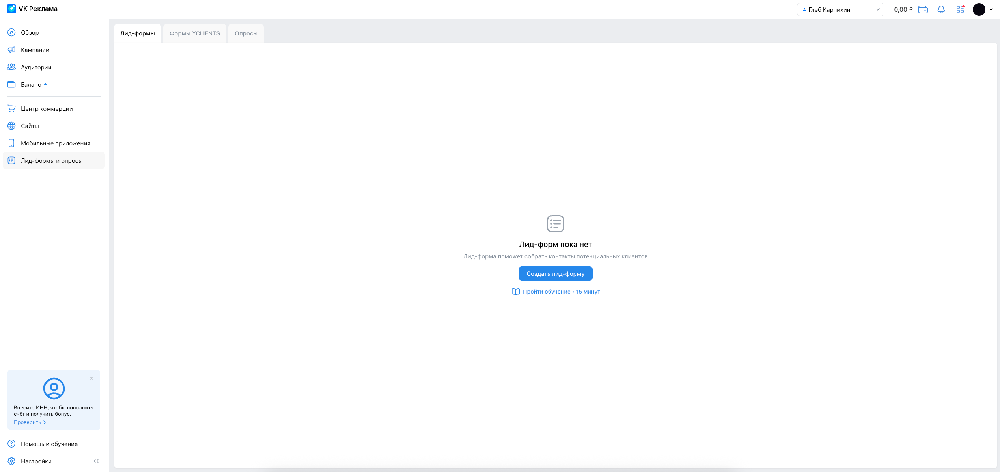

1. Лид-формы. Создание. Меню оформления. При нажатии кнопки "Создать лид-форму" открывается форма создания лид-формы.

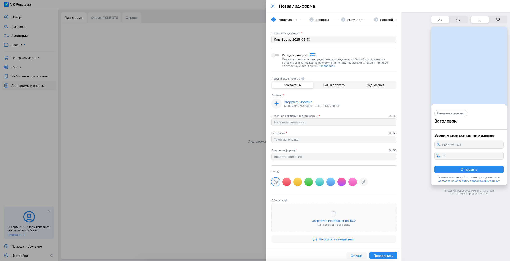

2. Лид-формы. Создание. Меню оформления. При нажатии на кнопку "Продолжить" без заполнения данных названия компании, заголовка,
описания формы и загрузки логотипа высвечивается ошибка.
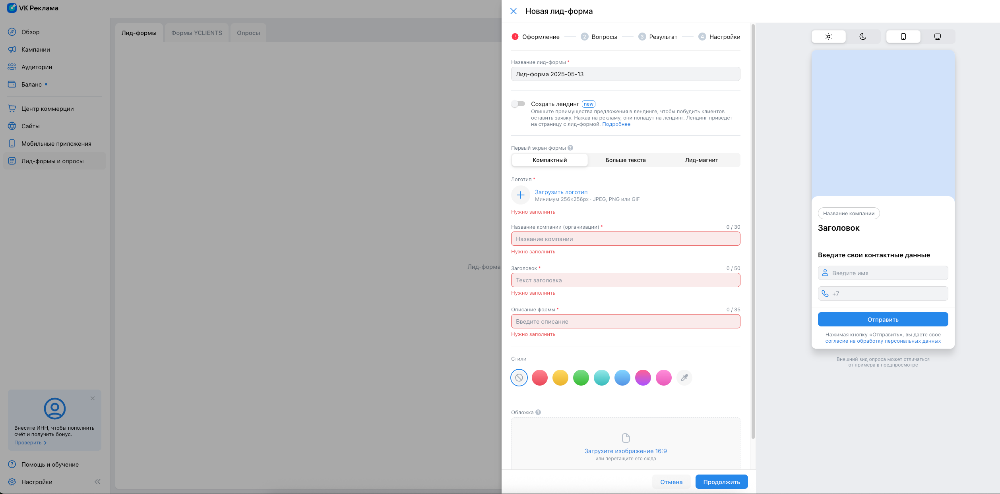

3. Лид-формы. Создание. Меню оформления. Загрузка логотипа. При нажатии на кнопку "Загрузить логотип" открывается окно для загрузки
логотипа.

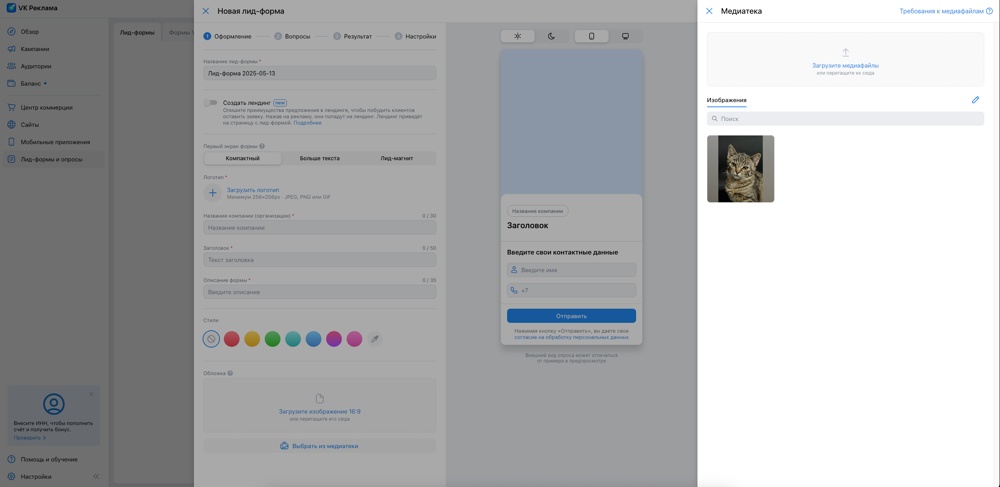

4. Лид-формы. Создание. Меню оформления. Загрузка логотипа. При нажатии на кнопку "Загрузите медиафайлы" открывается окно для загрузки
   медиафайлов.

5. Лид-формы. Создание. Меню оформления. Загрузка логотипа. При попытке загрузить файл с расширением, отличающимся от JPEG, PNG и GIF, 
   загрузка бесконечно виснет.

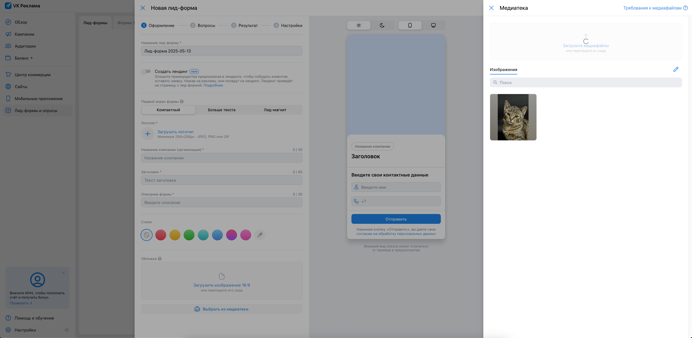

6. Лид-формы. Создание. Меню оформления. Загрузка логотипа. При попытке загрузить файл с расширением JPEG, PNG или GIF,
   файл успешно загружается.

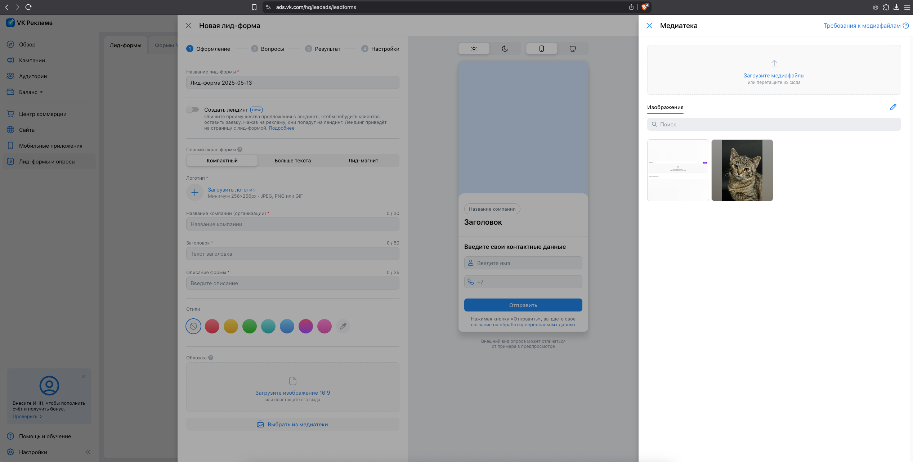

7. Лид-формы. Создание. Меню оформления. Загрузка логотипа. Нажатие на картинку. Открывается редактор изображения.

8. Лид-формы. Создание. Меню оформления. Загрузка логотипа. Нажатие на картинку. Открывается редактор изображения. Нажатие кнопки "Сохранить".

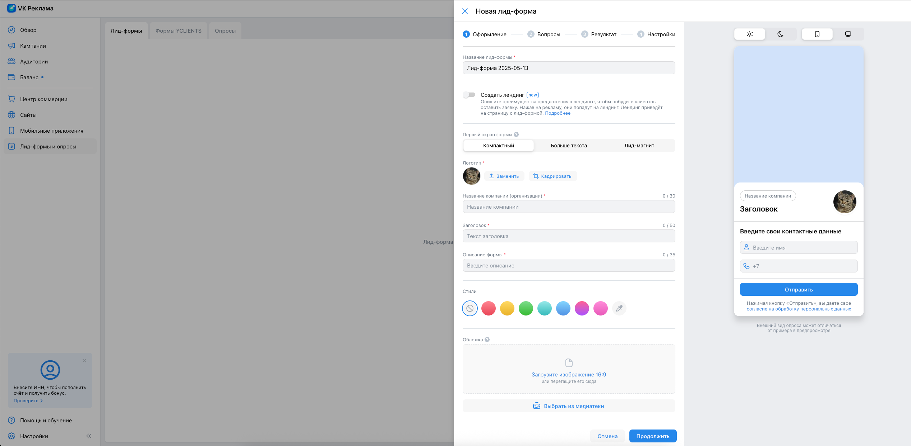

9. Лид-формы. Создание. Меню оформления. Загрузка логотипа. Нажатие на картинку. Открывается редактор изображения. Есть возможность кадрировать
изображение, а так же отменить изменения.

10. Лид-формы. Создание. Меню оформления. Логотип. После загрузки логотипа появляется возможность заменить его нажатием кнопки "Заменить",
либо кадрировать нажатием кнопки "Кадрировать".

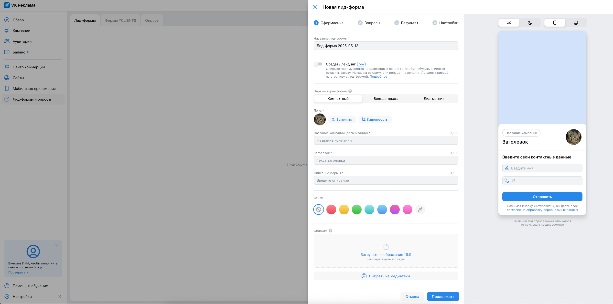

11. Лид-формы. Создание. Меню оформления. Логотип. При нажатии на кнопку "Заменить" открывается окно для загрузки
    медиафайлов.

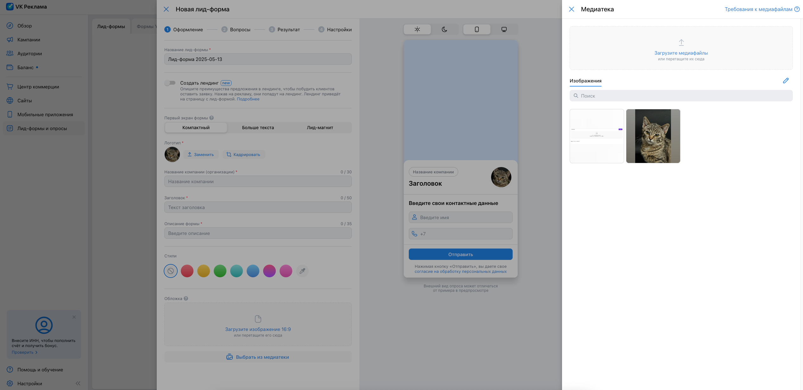

12. Лид-формы. Создание. Меню оформления. Логотип. При нажатии на кнопку "Кадрировать" открывается окно для кадрирования.

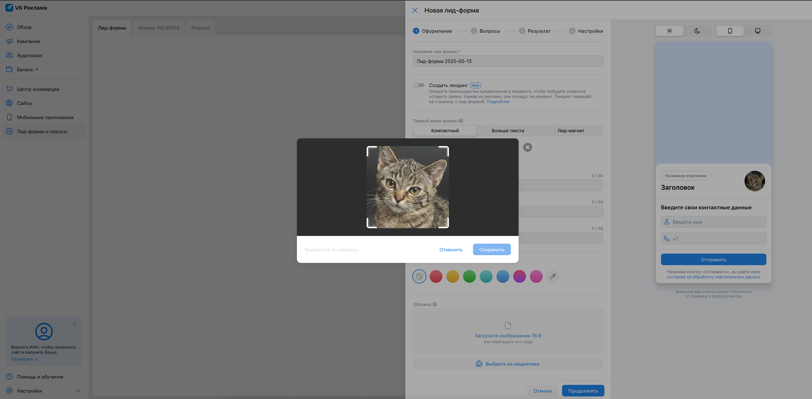

13. Лид-формы. Создание. Меню оформления. Меню оформления. Логотип. Окно для кадрирования. Можно изменять размер кадрирования

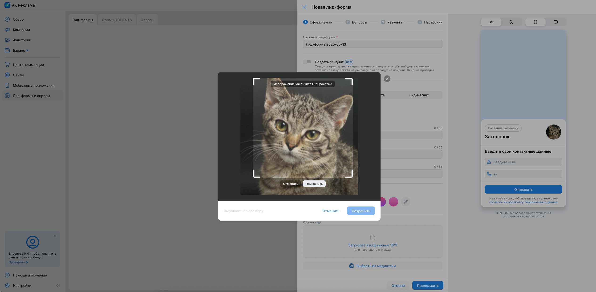

14. Лид-формы. Создание. Меню оформления. Логотип. Окно для кадрирования. Применить. Можно увидеть результат кадрирования и сохранить его.

15. Лид-формы. Создание. Меню оформления. Первый экран формы. При нажатии на кнопку "Больше текста", либо "Лид-магнит",
лид-форма меняется в соответствии с выбранной категорией.

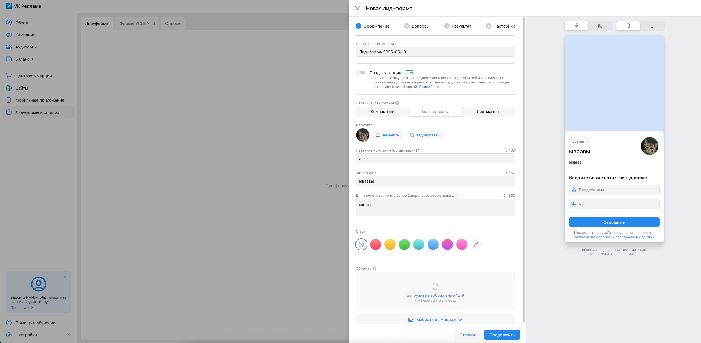

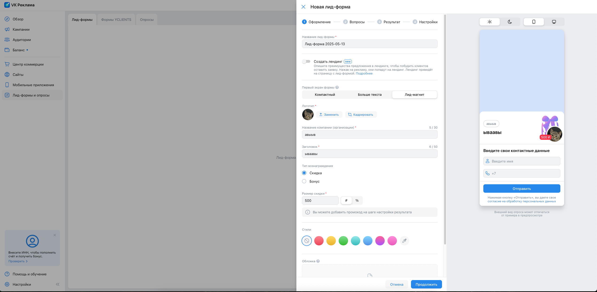

16. Лид-формы. Создание. Меню оформления. Стили. При выборе стиля (нажатии на какой-либо цвет), цветовая гамма меняется в соответствии с выбранным
стилем.

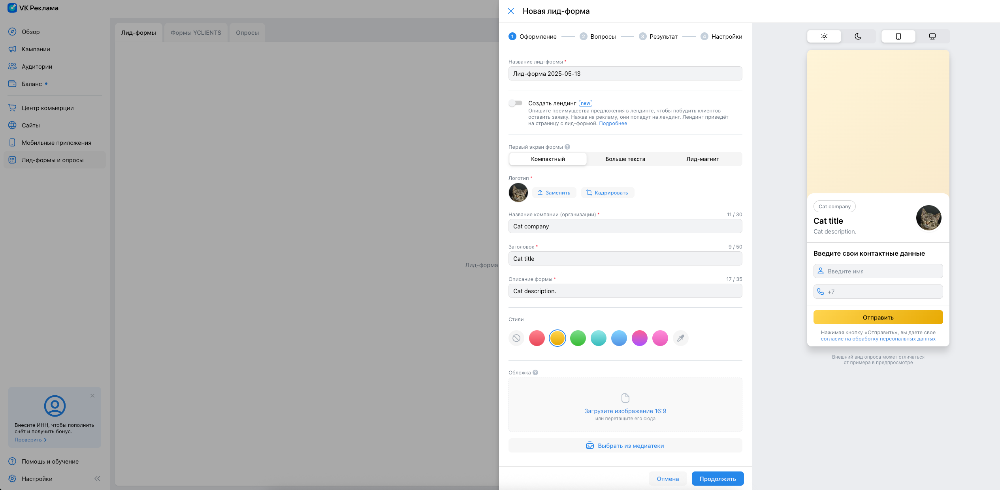

17. Лид-формы. Создание. Меню оформления. Обложка. При выборе стиля (нажатии на какой-либо цвет), цветовая гамма меняется в соответствии с выбранным
    стилем.

18. Лид-формы. Создание. Меню оформления. Обложка. При нажатии на кнопку "Загрузите изображение" открывается окно для загрузки
   изображения.

19. Лид-формы. Создание. Меню оформления. Обложка. При попытке загрузить файл с расширением, отличающимся от JPEG и PNG,
   загрузка бесконечно виснет.

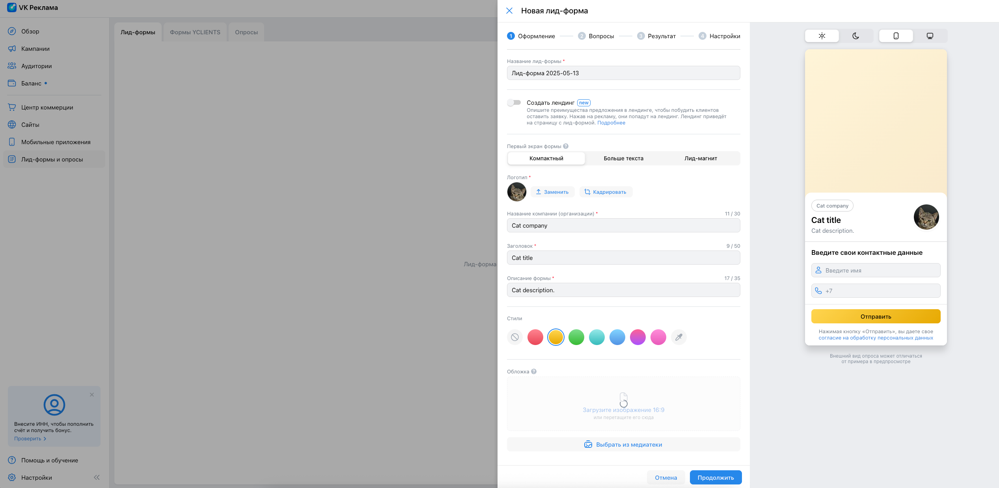

20. Лид-формы. Создание. Меню оформления. Обложка. Нажатие на картинку. Открывается редактор изображения. Нажатие кнопки "Сохранить".

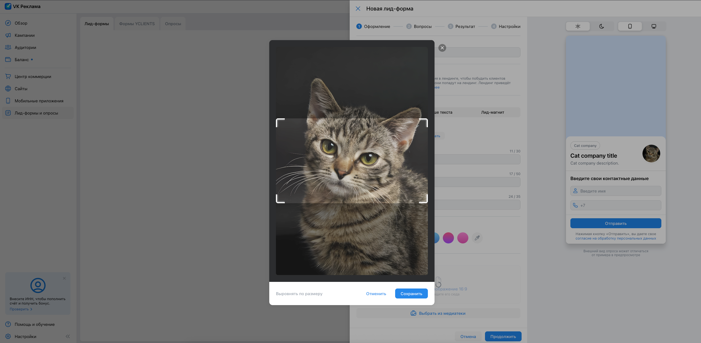

21. Лид-формы. Создание. Меню оформления. Нажатие на кнопку Продолжить. Открывается меню "Вопросы".

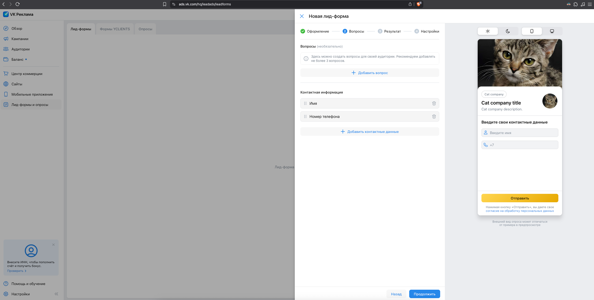

22. Лид-формы. Создание. Меню оформления. Нажатие на кнопку Продолжить. Меню вопросы. Раздел вопросы. Нажатие на кнопку "Добавить вопрос"
успешно создает форму вопроса.

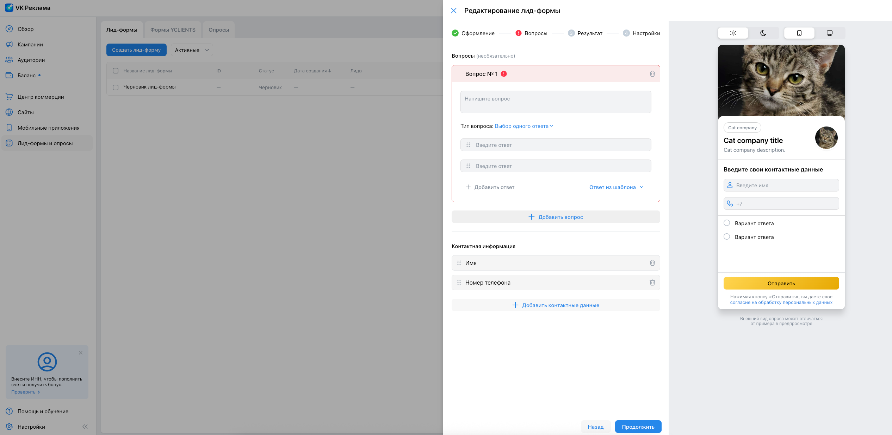

23. Лид-формы. Создание. Меню оформления. Нажатие на кнопку Продолжить. Меню вопросы. Раздел вопросы. Нажатие на кнопку "Добавить вопрос".
Нажатие кнопки "Продолжить". Успешно выводится сообщение о пустых полях в форме вопроса.

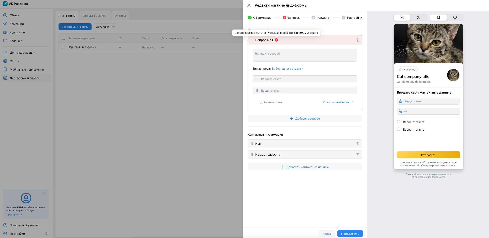

24. Лид-формы. Создание. Меню оформления. Нажатие на кнопку Продолжить. Меню вопросы. Раздел вопросы. Нажатие на кнопку "Добавить вопрос".
    Нажатие на селектор "Тип вопроса". Успешно выводится сообщение о пустых полях в форме вопроса.

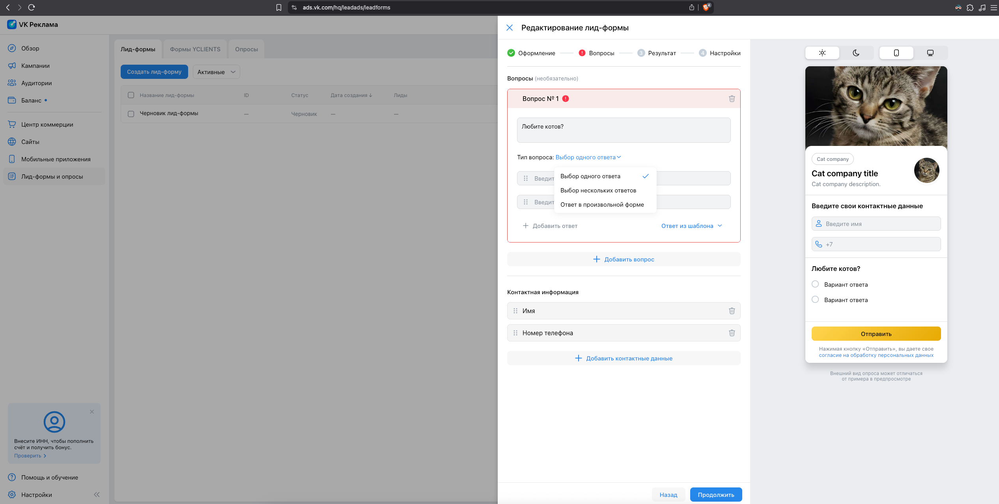

25. Лид-формы. Создание. Меню оформления. Нажатие на кнопку Продолжить. Меню вопросы. Раздел вопросы. Нажатие на кнопку "Добавить вопрос".
    Нажатие на селектор "Тип вопроса". Нажатия на варианты "Выбор нескольких ответов" и "Ответ в произвольной форме" успешно
меняет тип вопроса.

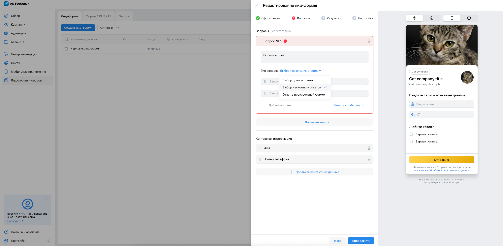

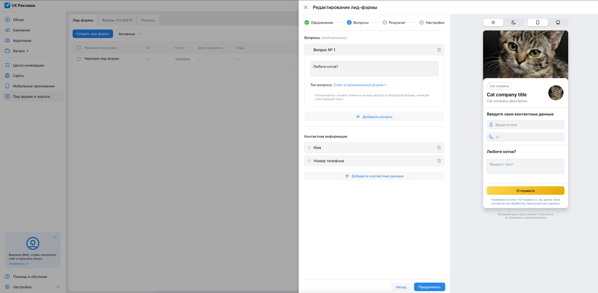

26. Лид-формы. Создание. Меню оформления. Нажатие на кнопку Продолжить. Меню вопросы. Раздел вопросы. Нажатие на кнопку "Добавить вопрос".
    Нажатие на селектор "Ответ из шаблона". Нажатия на варианты "Ничего из перечисленного" и "Затрудняюсь ответить" успешно
    добавляют выбранный вариант в ответы, селектор пропадает.

27. Лид-формы. Создание. Меню оформления. Нажатие на кнопку Продолжить. Меню вопросы. Раздел вопросы. Нажатие на кнопку "Добавить вопрос".
    Повторное нажатие кнопки "Добавить вопрос" успешно добавляет второй вопрос.

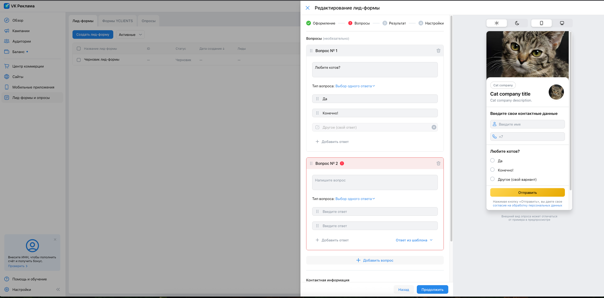

28. Лид-формы. Создание. Меню оформления. Нажатие на кнопку Продолжить. Меню вопросы. Раздел вопросы. Нажатие на кнопку "Добавить вопрос".
    Нажатие на значок корзины успешно удаляет вопрос.

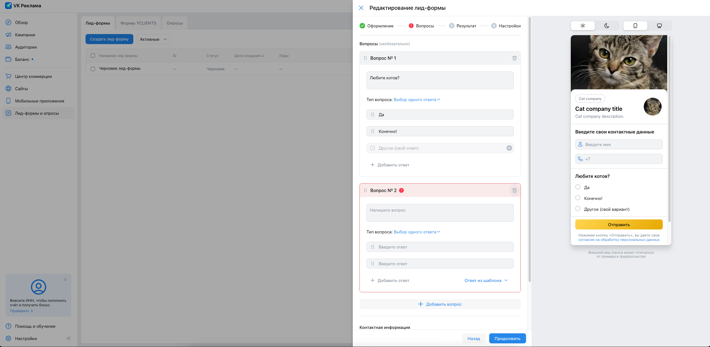

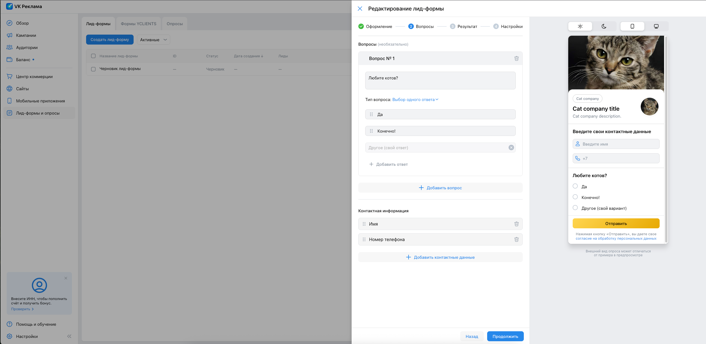

29. Лид-формы. Создание. Меню оформления. Нажатие на кнопку Продолжить. Меню вопросы. Раздел вопросы. Нажатие на кнопку "Добавить вопрос".
    Нажатие на кнопку добавить ответ успешно добавляет ответ.

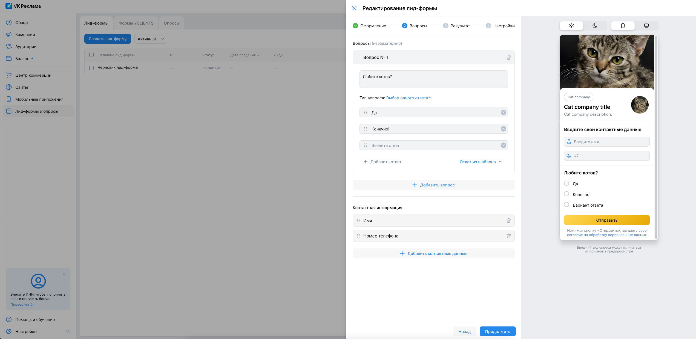

30. Лид-формы. Создание. Меню оформления. Нажатие на кнопку Продолжить. Меню вопросы. Раздел контактная информация. Нажатие на кнопку "Добавить контактные данные" открывает
модалку с вариантами контактной информации.

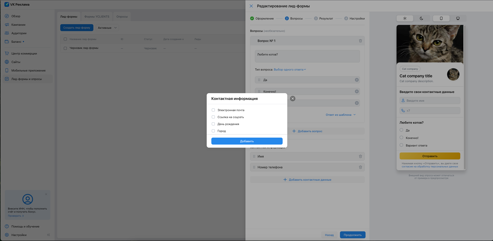

31. Лид-формы. Создание. Меню оформления. Нажатие на кнопку Продолжить. Меню вопросы. Раздел контактная информация. Нажатие на кнопку "Добавить контактные данные".
Нажатие кнопки добавить без выбранных пунктов закрывает модалку. 

32. Лид-формы. Создание. Меню оформления. Нажатие на кнопку Продолжить. Меню вопросы. Раздел контактная информация. Нажатие на кнопку "Добавить контактные данные".
Выбор нескольких (одного) вариантов (варианта) контактных данных. Нажатие на кнопку "Добавить" успешно добавляет выбранные варианты (вариант) в раздел "Контактная информация".

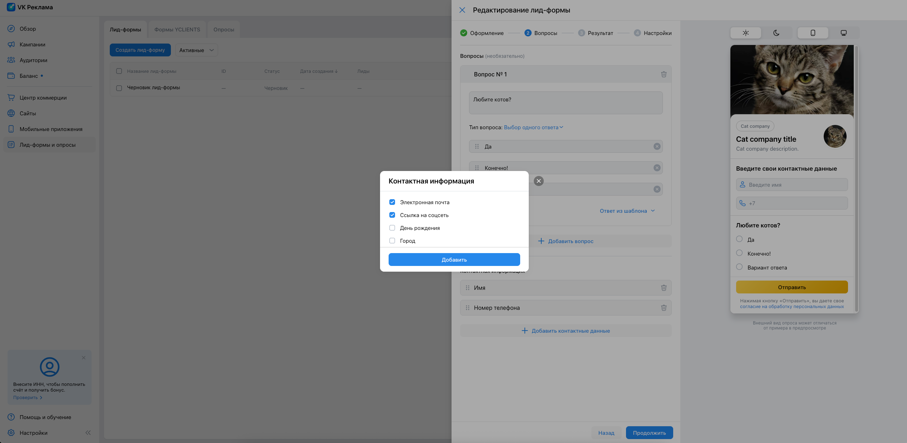

33. Лид-формы. Создание. Меню оформления. Нажатие на кнопку Продолжить. Меню вопросы. Раздел контактная информация. 
Нажатие на корзину успешно удаляет вариант контактных данных.

34. Лид-формы. Создание. Меню оформления. Нажатие на кнопку Продолжить. Меню вопросы. Раздел контактная информация.
    Нажатие на корзину для каждого варианта. Выводится предупреждение о необходимости минимального количества полей в данном разделе.

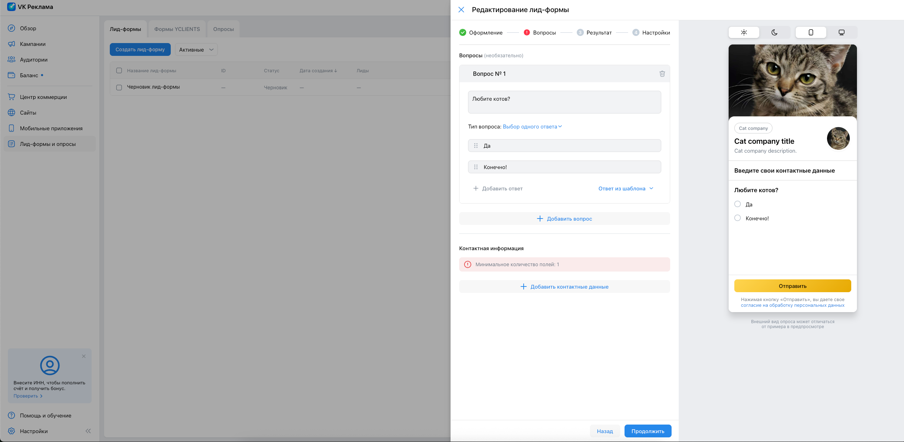

35. Лид-формы. Создание. Меню оформления. Нажатие на кнопку Продолжить. Меню вопросы. Нажатие на кнопку Продолжить. Меню результат.

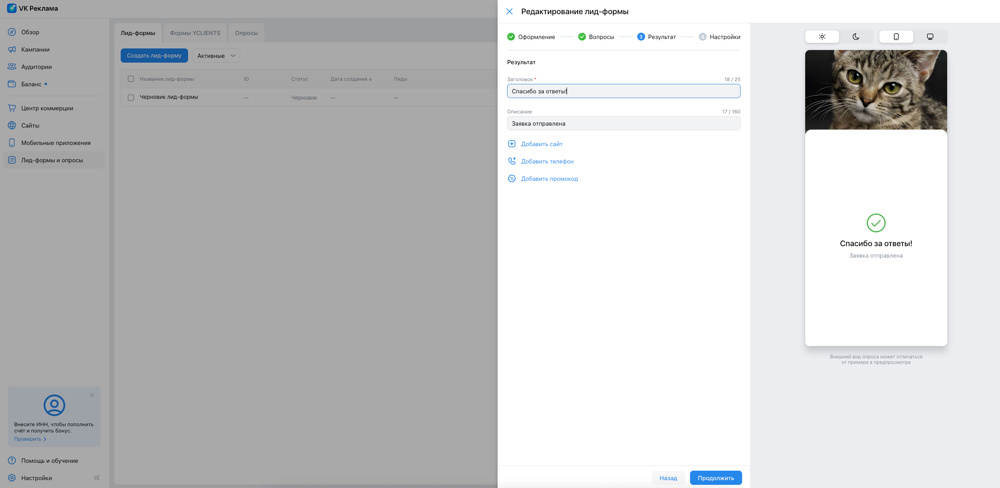

36. Лид-формы. Создание. Меню оформления. Нажатие на кнопку Продолжить. Меню вопросы. Нажатие на кнопку Продолжить. Меню результат.
При пустом поле заголовок корректно отображается ошибка.

37. Лид-формы. Создание. Меню оформления. Нажатие на кнопку Продолжить. Меню вопросы. Нажатие на кнопку Продолжить. Меню результат.
Нажатия на кнопки "Добавить сайт", "Добавить телефон" и "Добавить промокод".

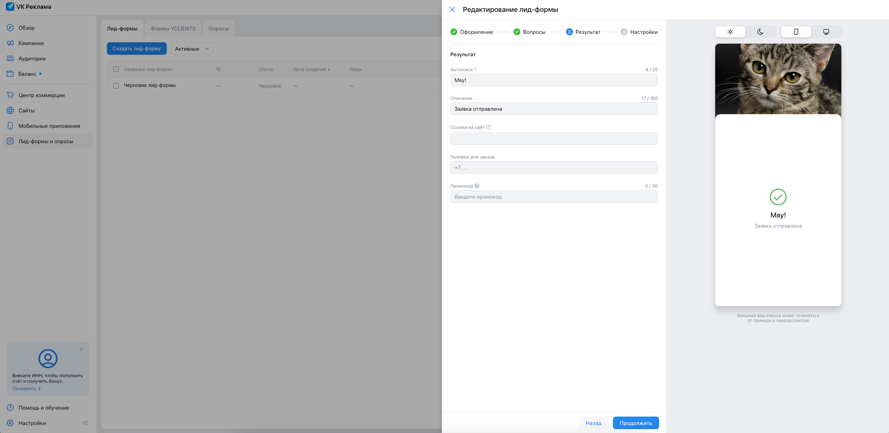

38. Лид-формы. Создание. Меню оформления. Нажатие на кнопку Продолжить. Меню вопросы. Нажатие на кнопку Продолжить. Меню результат.
Нажатия на кнопки "Добавить сайт", "Добавить телефон" и "Добавить промокод". При нажатии на кнопку продолжить с пустыми полями,
они не добавляются на форму.

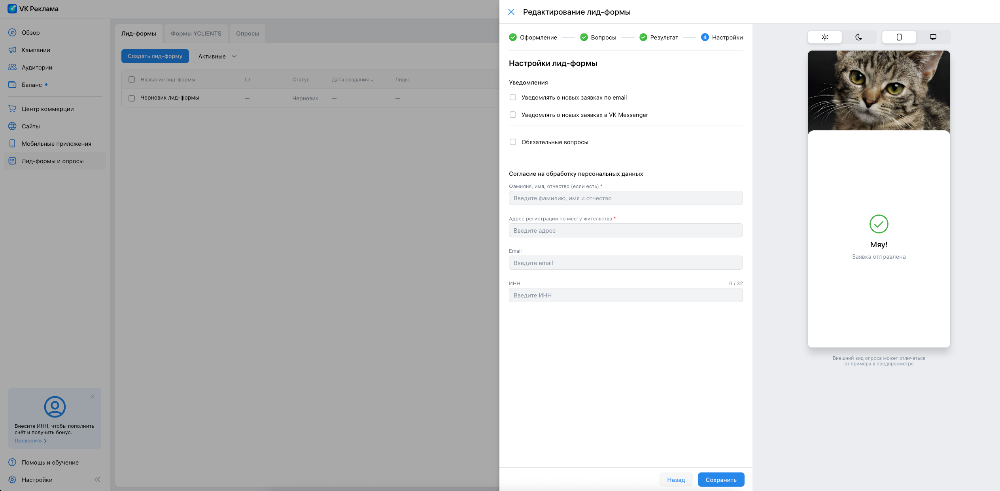

39. Лид-формы. Создание. Меню оформления. Нажатие на кнопку Продолжить. Меню вопросы. Нажатие на кнопку Продолжить. Меню результат.
Нажатие кнопки продолжить. Меню Настройки.

40. Лид-формы. Создание. Меню оформления. Нажатие на кнопку Продолжить. Меню вопросы. Нажатие на кнопку Продолжить. Меню результат.
    Нажатие кнопки продолжить. Меню Настройки. Нажатие на чекбокс "Уведомлять о новых заявках по email" открывает меню ввода email.

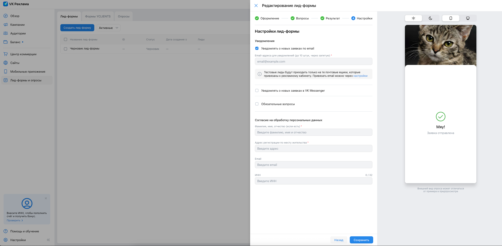

41. Лид-формы. Создание. Меню оформления. Нажатие на кнопку Продолжить. Меню вопросы. Нажатие на кнопку Продолжить. Меню результат.
    Нажатие кнопки продолжить. Меню Настройки. Нажатие на чекбокс "Уведомлять о новых заявках по email". При оставлении этого поля пустым
и заполнении всех других обязательных полей, форма сохраняется, при этом само поле c email отмечено обязательным.

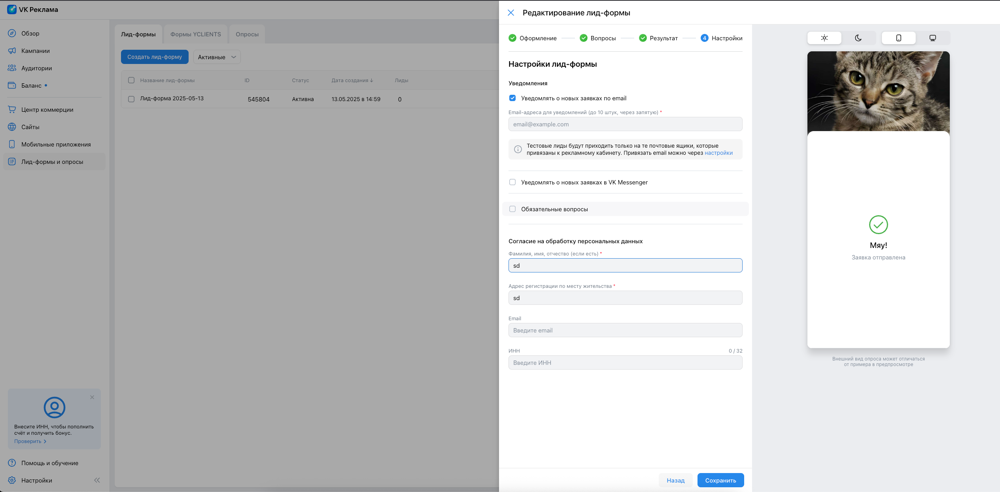

42. Лид-формы. Создание. Меню оформления. Нажатие на кнопку Продолжить. Меню вопросы. Нажатие на кнопку Продолжить. Меню результат.
    Нажатие кнопки продолжить. Меню Настройки. Нажатие на чекбокс "Обязательные вопросы" вызывает модальное окно.  

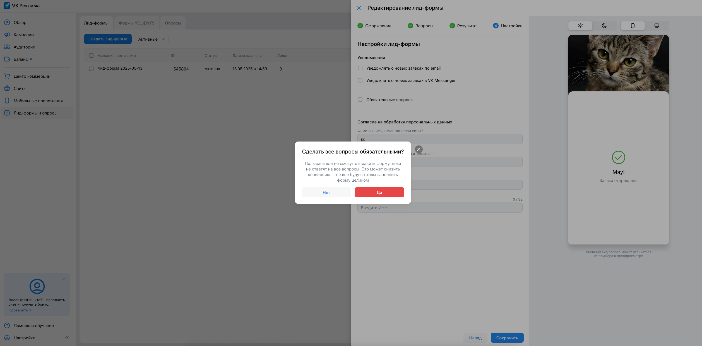

43. Лид-формы. Создание. Меню оформления. Нажатие на кнопку Продолжить. Меню вопросы. Нажатие на кнопку Продолжить. Меню результат.
    Нажатие кнопки продолжить. Меню Настройки. Модальное окно "Сделать все вопросы обязательными". Нажатие на кнопку "Да" отмечает чекбокс,
"Нет" закрывает модальное окно.

44. Лид-формы. Создание. Меню оформления. Нажатие на кнопку Продолжить. Меню вопросы. Нажатие на кнопку Продолжить. Меню результат.
    Нажатие кнопки продолжить. Меню Настройки. Нажатие на кнопку Продолжить. Успешно отображаются ошибки для пустых полей.

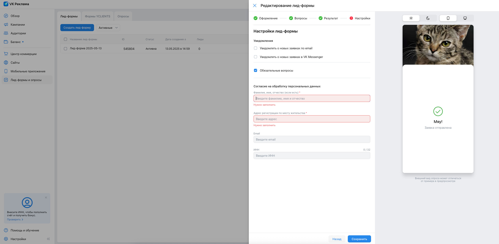

45. Лид-формы. Создание. Меню оформления. Нажатие на кнопку Продолжить. Меню вопросы. Нажатие на кнопку Продолжить. Меню результат.
    Нажатие кнопки продолжить. Меню Настройки. Ввод данных обязательных полей. Нажатие на кнопку продолжить. Успешное сохранение лид-формы.

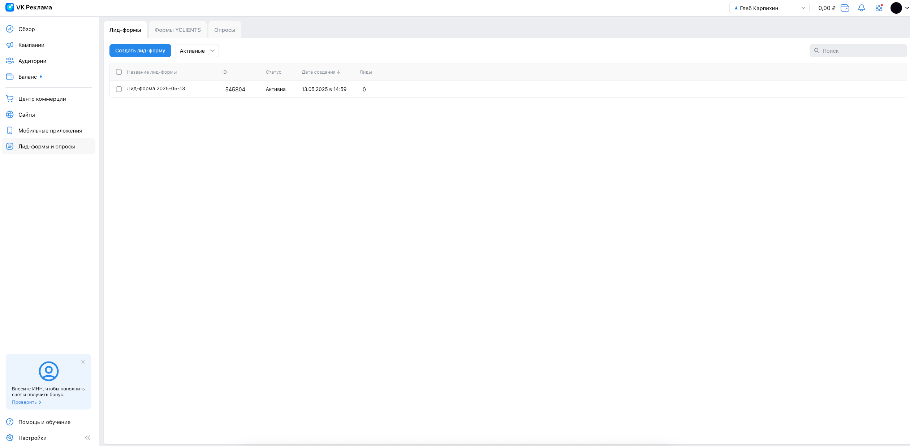